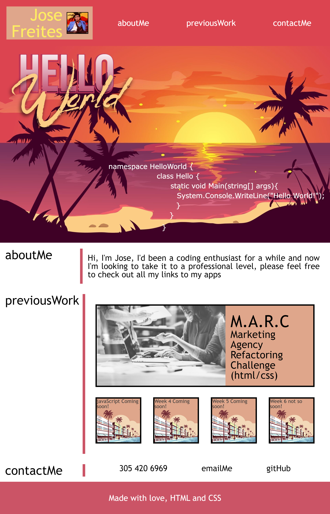

# Challenge Week 2: Personal Portfolio Website

## Description
I wanted to practice and apply the knowledge I acquired in the second module of the bootcamp as well as being able to showcase my work as I learn through the bootcamp so I did this website to be able to display my work to prospect employers, this code meets accessibility standards, the website design is responsive even thought it needs refiment, I learn that css can get tricky and that design is a lot harder than expected, I'd always preferred back-end and it was good experience to step out of the comfort zone

## Usage
The links on the top of the page can help you find the sections more quickly, there's links to my work in the main section of the page, the links coming soon have some good music in then that you can listen to while grading this assigment, also links to my contact info and github are available at the bottom of the page

## Credits
Deployed challange URL https://venecoderr.github.io/Challenge-week-2-PPW/

## License
No license added